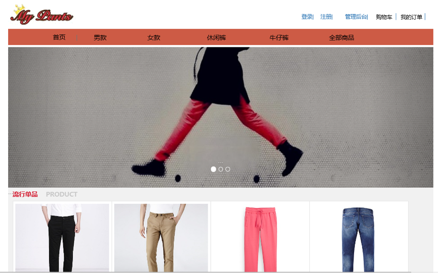
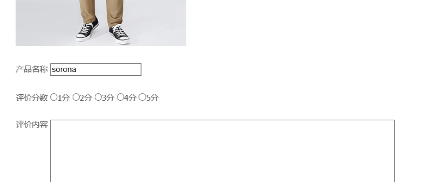
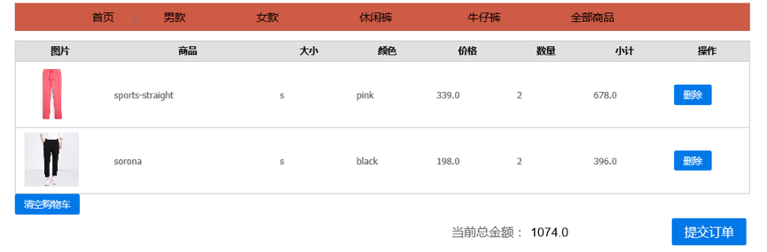
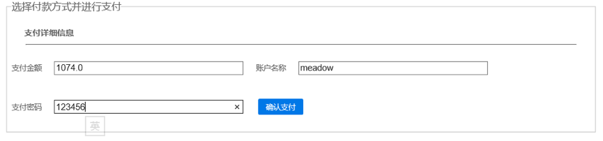
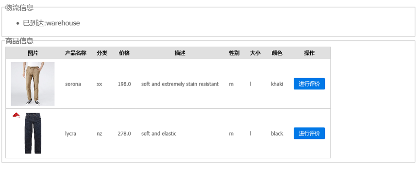
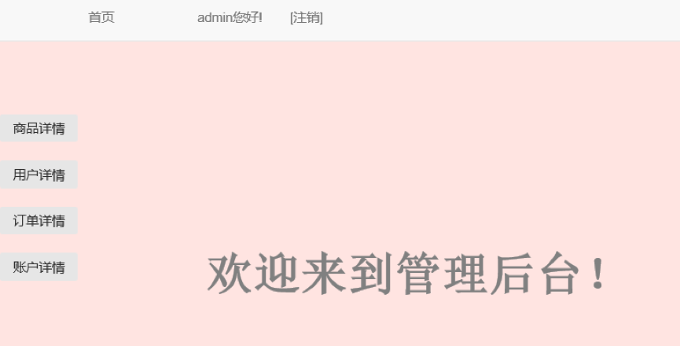
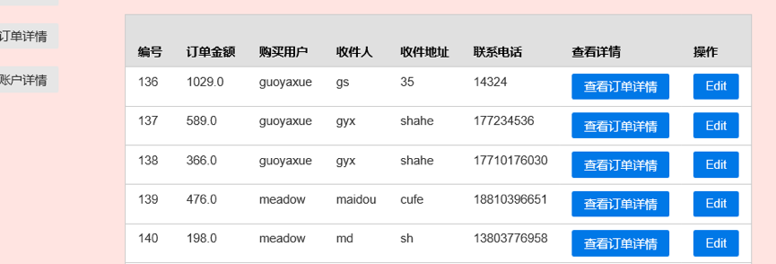

# My Pants E-Commerce Platform 👖

This a web-based E-commerce platform focuses on pants business, categorizes products into man/ woman/ leisure and jeans, supports functions including sign up, sign in, shopping cart, placing orders and logistics tracking. Users are divided into normal users that mainly view products and place orders, as well as super users that have previlage to edit product, order, user and account details. 

## Technology Stack

MCV, JSP, Java, MySQL, HTML, CSS, Bootstrap.

## Get Started

  * Homepage. All pants product are categorized into four kinds and shown in the navigation bar. 

  * Rating. Users can rate a product by score and comments.

  * Shopping cart. Users can view their chosen product info and count here.

  * Pay. Users can pay online by deducting amount from their account.

  * Logistics tracking. Users can view the logistic info like "Delivered", "Arriving", etc.

  * Admin portal. Super users with highest previlige can sign in this portal and edit product, user, order information.

## Author

 * This is an individual project completed by **Yaxue Guo**.
 
## Acknowledgement

  * Requirements of this project is from 2015 Fall **Curriculum Project of Web Design and Development** of School of Information, Central University of Finance and Economics.
  